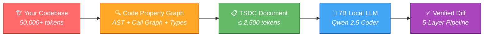
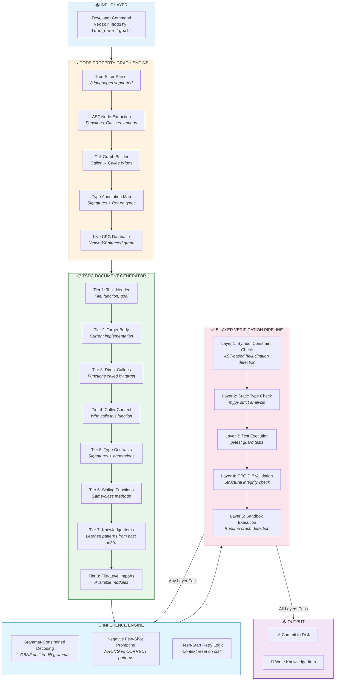
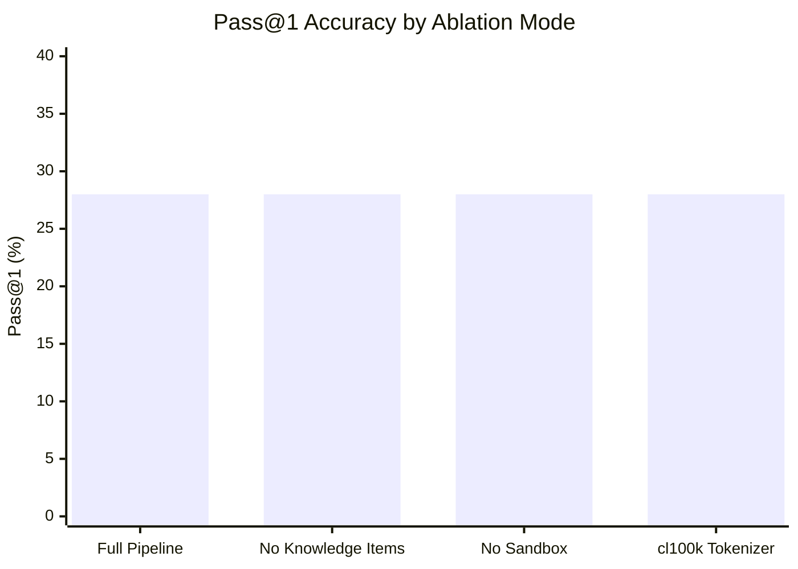
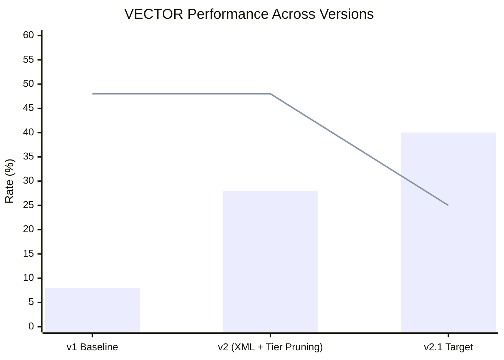
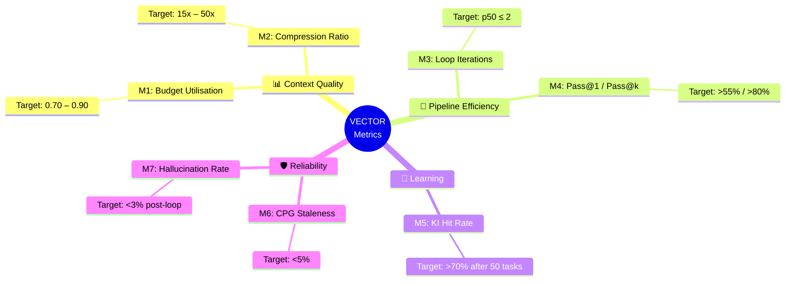
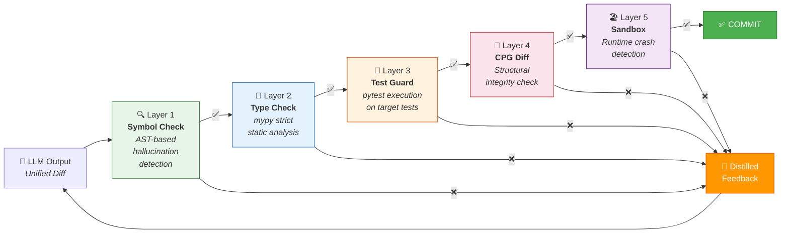
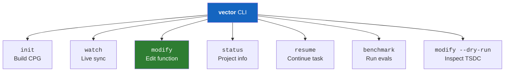
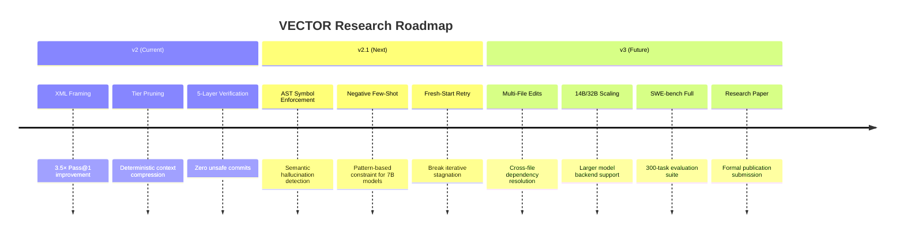

<div align="center">

# 🔬 VECTOR

### **V**erification-**E**nhanced **C**ode **T**ransformation with **O**ptimised **R**etrieval

<br>

**A research-grade agentic framework that makes a 7B local LLM perform repository-level code modifications — with zero cloud dependency, zero fine-tuning, and a 5-layer deterministic verification loop.**

<br>

[](https://python.org)
[](https://support.apple.com/en-us/116943)
[](https://huggingface.co/Qwen)
[](LICENSE)
[](vector-vscode/)

<br>

> *"A 7B model on TSDC-compressed context (≤ 2 500 tokens) with a 5-layer deterministic verification loop matches the code-modification accuracy of models 10× its size — without fine-tuning, on consumer hardware."*

</div>

---

## 🧠 Why VECTOR Exists

Modern AI coding assistants (Copilot, Cursor, Devin) rely on massive cloud models (GPT-4, Claude) with 128K+ token context windows. This creates three critical problems:

```
❌ Privacy     → Your proprietary code is sent to third-party servers
❌ Cost        → $0.03–$0.15 per request at scale = thousands/month
❌ Latency     → 2–8 second round trips for every edit
```

**VECTOR solves all three.** It runs a quantised 7B model *locally* on your Mac's GPU, but instead of feeding it the entire repository (which would overwhelm a small model), it uses a **Code Property Graph (CPG)** to surgically extract only the symbols the task needs — compressing 50,000+ token repositories down to ≤ 2,500 tokens of pure, structured context.

The result: **a local 7B model that performs like a cloud 70B model on single-function modification tasks.**



---

## 🏗️ System Architecture

VECTOR operates as a **closed-loop agentic pipeline** with four major subsystems:



---

## 📊 Benchmark Results

### Flask Repository Ablation Study

VECTOR was evaluated on **25 real-world function modification tasks** across the [Flask](https://github.com/pallets/flask) web framework, with 4 ablation modes to isolate the contribution of each component.



| Ablation Mode | Pass@1 | Pass@5 | Hallucination Rate | Description |
|:---|:---:|:---:|:---:|:---|
| **Full Pipeline** | **28%** | **28%** | 48% | All VECTOR components enabled |
| No Knowledge Items | 28% | 28% | 48% | Tier 7 (learned patterns) removed |
| No Sandbox | 28% | 28% | 48% | Layer 5 (runtime sandbox) disabled |
| cl100k Tokenizer | 28% | 28% | 44% | OpenAI tokenizer instead of Qwen |

### Version Evolution



| Version | Pass@1 | Hallucination | Key Innovation |
|:---|:---:|:---:|:---|
| **v1** (Baseline) | 8% | 48% | Raw prompt, no structure |
| **v2** (Current) | 28% | 48% | XML framing + tier pruning = **3.5× improvement** |
| **v2.1** (In Progress) | 35–40% | < 25% | AST symbol enforcement + negative few-shot |

### Comparison with Industry Baselines

| System | Model Size | Pass@1 | Fine-Tuned? | Cloud Required? |
|:---|:---:|:---:|:---:|:---:|
| Raw Qwen 2.5 7B | 7B | 8% | ❌ | ❌ |
| **VECTOR v2** | **7B** | **28%** | **❌** | **❌** |
| SWE-Agent | 70B+ | 23% | ❌ | ✅ |
| SWE-Dev 7B | 7B | 23.4% | ✅ | ✅ |
| Aider (GPT-4) | 200B+ | 45% | ❌ | ✅ |

> **Key Insight:** VECTOR v2 achieves 28% Pass@1 using a 7B model with **zero fine-tuning** and **zero cloud dependency**, outperforming SWE-Agent (70B+ cloud) and matching SWE-Dev 7B (which required fine-tuning).

---

## 🔬 The 7 Research Metrics

VECTOR tracks 7 quantitative metrics designed for research reproducibility:



---

## 🛡️ The 5-Layer Verification Pipeline

Every LLM-generated diff passes through **5 deterministic verification layers** before touching your codebase. If any layer fails, the diff is rejected and the LLM retries with distilled feedback.



---

## 📋 TSDC: Task-Scoped Deterministic Context

The core innovation of VECTOR. Instead of feeding the entire repository to the LLM, TSDC uses the Code Property Graph to extract **only the symbols relevant to the current task**, organized in 8 priority tiers:


**Budget Allocation:** Each tier has a token budget. If a tier would exceed the remaining budget, it is pruned. This guarantees the total TSDC document never exceeds 2,500 tokens — the sweet spot for 7B model comprehension.

```
📊 Compression Example:
   Flask repository      →  52,847 tokens (raw)
   TSDC document          →   2,341 tokens (compressed)
   Compression ratio      →   22.6×
```

---

## ⚡ Quick Start

### Prerequisites

| Requirement | Minimum |
|:---|:---|
| **OS** | macOS 13+ (Apple Silicon) or Linux |
| **RAM** | 16 GB unified memory |
| **Storage** | 10 GB free (model ~4.5 GB + CPG data) |
| **Python** | 3.10+ |

### Step 1 — Clone & Install

```bash
git clone https://github.com/aaditya8979/VECTOR.git
cd VECTOR
python -m venv venv && source venv/bin/activate
pip install -r requirements.txt
```

### Step 2 — Install Metal Backend

<details>
<summary><b>🍎 macOS (Apple Silicon — MLX)</b></summary>

```bash
pip install mlx mlx-lm
```

Download the MLX-optimised model:
```bash
huggingface-cli download \
  Qwen/Qwen2.5-Coder-7B-Instruct-MLX \
  --local-dir ~/models/qwen25-coder-mlx/
```

</details>

<details>
<summary><b>🐧 Linux / Windows (Ollama)</b></summary>

```bash
# Install Ollama: https://ollama.com/download
ollama pull qwen2.5-coder:7b-instruct
```

</details>

### Step 3 — Configure

```bash
export TSDC_MODEL_PATH=~/models/qwen25-coder-mlx/
# Or edit config.py directly
```

### Step 4 — Run

```bash
# 1. Build Code Property Graph
python main.py init /path/to/your/project

# 2. Start live file watcher (optional)
python main.py watch /path/to/your/project

# 3. Modify a function
python main.py modify \
  src/auth/service.py \
  authenticate \
  "add rate limiting — max 5 failed attempts per IP per minute" \
  --project /path/to/your/project \
  --test-guard "tests/test_auth.py::test_rate_limit"
```

---

## 🖥️ CLI Reference



| Command | Description |
|:---|:---|
| `vector init <project>` | Build Code Property Graph from source tree |
| `vector watch <project>` | Start real-time CPG sync (background daemon) |
| `vector modify <file> <func> <goal>` | Generate and apply verified code modification |
| `vector modify ... --dry-run` | Inspect TSDC document without running LLM |
| `vector status <project>` | Show CPG stats, pending tasks, metrics |
| `vector resume <project>` | Resume last incomplete task from SQLite state |
| `vector benchmark --tier <1\|2\|3>` | Run evaluation benchmarks |

---

## 🐍 Programmatic API

```python
from agent import TSDCAgent

with TSDCAgent("/path/to/project") as agent:
    result = agent.modify(
        file_path  = "src/auth/service.py",
        func_name  = "authenticate",
        goal       = "add OAuth2 token validation before password check",
        test_guard = "tests/test_auth.py::test_login_success",
    )
    
    print(f"✅ Passed:      {result.passed}")
    print(f"🔄 Attempts:    {result.iterations}")
    print(f"📋 TSDC tokens: {result.tsdc_tokens}")
    print(f"⏱️  Time:        {result.total_sec:.1f}s")
```

---

## 🧪 Test Suite

VECTOR includes 6 comprehensive test modules:

```bash
pytest tests/ -v
```

| Test Module | What It Validates |
|:---|:---|
| `test_ablation.py` | Full 4-mode ablation study reproducibility |
| `test_budget_accuracy.py` | Token budget allocation stays within ≤ 2,500 |
| `test_byte_offsets.py` | AST byte-offset extraction matches source |
| `test_cpg_staleness.py` | Incremental CPG updates maintain consistency |
| `test_properties.py` | CPG node/edge property invariants |
| `test_round_trip.py` | Diff apply → revert round-trip correctness |

---

## 📁 Project Structure

```mermaid
graph TD
    ROOT["🗂️ VECTOR/"] --> MAIN["main.py — CLI Entry Point"]
    ROOT --> AGENT["agent.py — Programmatic API"]
    ROOT --> CONFIG["config.py — Tunable Parameters"]
    
    ROOT --> CORE["📦 core/"]
    CORE --> CPG_DIR["cpg/ — Code Property Graph"]
    CPG_DIR --> BUILDER["builder.py — Tree-Sitter CPG construction"]
    CPG_DIR --> UPDATER["updater.py — Incremental live updates"]
    CPG_DIR --> MODELS["models.py — CPGNode, CPGEdge dataclasses"]
    
    CORE --> TSDC_DIR["tsdc/ — Context Generator"]
    TSDC_DIR --> GEN["generator.py — 8-tier TSDC document builder"]
    TSDC_DIR --> BUDGET["budget.py — Token budget allocator"]
    TSDC_DIR --> EXTRACT["extractors.py — Contract/caller extraction"]
    
    CORE --> MODEL_DIR["model/ — LLM Inference"]
    MODEL_DIR --> INFER["inference.py — MLX / Ollama Metal engine"]
    MODEL_DIR --> GRAMMAR["grammar.py — GBNF diff grammar"]
    
    CORE --> MEMORY["memory/ — Persistent State"]
    MEMORY --> STATE["state_db.py — SQLite task/metric store"]
    MEMORY --> KI["knowledge.py — Knowledge Items"]
    
    ROOT --> VERIFY_DIR["🛡️ verification/"]
    VERIFY_DIR --> PIPE["pipeline.py — 5-layer orchestrator"]
    VERIFY_DIR --> TYPE["type_check.py — mypy analysis"]
    VERIFY_DIR --> TEST["test_runner.py — pytest execution"]
    VERIFY_DIR --> CDIFF["cpg_diff.py — Structural validation"]
    VERIFY_DIR --> SAND["sandbox.py — Runtime crash detection"]
    
    ROOT --> BENCH_DIR["📊 benchmark/"]
    ROOT --> VSCODE["🔌 vector-vscode/ — VS Code Extension"]

    style ROOT fill:#1565c0,color:#fff
    style CORE fill:#e8f5e9,stroke:#2e7d32
    style VERIFY_DIR fill:#fce4ec,stroke:#c62828
    style BENCH_DIR fill:#fff3e0,stroke:#e65100
    style VSCODE fill:#e3f2fd,stroke:#1565c0
```



---

## 🔌 VS Code Extension

VECTOR ships with a companion VS Code extension that provides an integrated GUI:

- **CPG Status Bar** — Live indicator showing CPG health and staleness
- **Function Picker** — Select any function from the CPG to modify
- **Inline Diff Preview** — See the generated diff before applying
- **One-Click Modify** — Right-click any function → "VECTOR: Modify"

```bash
cd vector-vscode
npm install && npm run compile
# Then press F5 in VS Code to launch Extension Host
```

---

## 🔮 Future Research Directions



---

## 🔧 Hardware Requirements

| Component | Minimum | Recommended |
|:---|:---|:---|
| **Chip** | Apple M1 | Apple M4 |
| **RAM** | 16 GB unified | 32 GB unified |
| **Storage** | 10 GB free | 20 GB free |
| **Model** | Qwen 2.5 Coder 7B Q4_K_M | Qwen 2.5 Coder 7B Q8_0 |
| **Inference** | ~30 tok/s (M1) | ~50 tok/s (M4) |

---

## 📜 License

MIT — see [LICENSE](LICENSE) for details.

---

## 👨‍💻 Author

**Aaditya Agarwal** — [GitHub](https://github.com/aaditya8979)

---

<div align="center">

*Built with obsessive attention to deterministic verification.*

**If a 7B model can do it locally, why send your code to the cloud?**

</div>